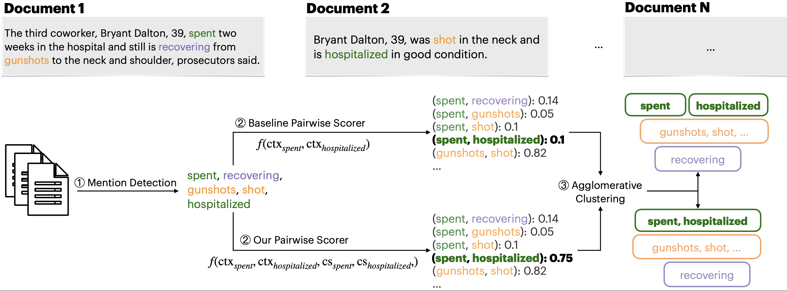

# Multi-Event Commonsense in event coreference (coref-csk)

The goal of cross-document event coreference resolution is to determine if various event mentions (e.g. shot, gunshot), across one or more documents, refer to the same event.  We explore how to generate additional knowledge on what happens before and after events in a complex sentence, and how it  influences event coreference resolution for lexically divergent mention pairs.
The architecture of our event coreference model, exemplified on a set of documents is shown below. We enhance the
pairwise scorer, originally based on contextual similarity (top), with temporal commonsense inferences (bottom).
Such inferences help identify lexically divergent co-referring pairs, such as _spent_ [time at a hospital] _and hospitalized_.




## Citation

```
@article{Ravi2023WhatHB,
  title={What happens before and after: Multi-Event Commonsense in Event Coreference Resolution},
  author={Sahithya Ravi and Christy Tanner and Raymond Ng and Vered Shwarz},
  journal={ArXiv},
  year={2023},
  volume={abs/2302.09715}
}

```


## Getting started

### 1. Install python3 requirements

`pip install -r requirements.txt` 


### 2. Extract mentions and raw text from ECB+ 

Run the following script in order to extract the data from ECB+ dataset
 and build the gold conll files. 
The ECB+ corpus can be downloaded [here](http://www.newsreader-project.eu/results/data/the-ecb-corpus/).

`
python get_ecb_data.py --data_path path_to_data
`

### 3. External knowledge 
Any type of knowledge source or model can be used to construct the before and after inferences for each event.  The sources we used in this work include: GPT3-few shot, GPT3-finetuned, COMET etc. 
The inferences are converted to embeddings and fed into the coreference pipeline through an attention-based fusion with the span embeddings.
In order to achieve this, the first step is generating the embeddings to be fed into the pipeline.

Place the before and after inferences from your knowledge source or model under a folder. 
For example, for gpt3 based inferences:
Place it under gpt3/ as follows.
gpt3/output_dev.csv
gpt3/output_train.csv
gpt3/output_test.csv

This folder path should be configured accordingly in all config files under configs/. Modify the config parameters `inferences_path, text_embeddings_path`.
Now run,  python3 text_incorporation/expansion_embeddings.py
It should save the embeddings for all the splits as a pickle file.
If you do not want to use RoBERTa based embeddings, use your own embedding format and update config parameter `expansion_dimension` to reflect the size of the embeddings.


### 4. Training methods

There are 3 ways to train this pairwise scorer:

1. Pipeline: first train a span scorer, then train the pairwise scorer using the same spans at each epoch. 
2. Continue: pre-train the span scorer, then train the pairwise scorer while keep training the span scorer.
3. End-to-end: train together both models from scratch.


In order to choose the training method, you need to set the value of the `training_method` in 
the `config_pairwise.json` to `pipeline`, `continue` or `e2e`. 

In order to choose the training method, you need to set the value of the `training_method` in 
the `config_pairwise.json` to `pipeline` for the gold mentions. There is not need to use continual training as the span scoring is not needed for gold mentions.
This is the only method that works right now with knowledge addition.

Important parameters to set in `config_pairwise.json` and `config_clustering.json`:
  * `training_method`: (pipeline, continue, e2e)
  * `subtopic`: (true, false) whether to train at the topic or subtopic level (ECB+ notions). 
  * `include_text`: Whether to use text based knowledge embeddings or not
  * `fusion`: can be 'intraspan', 'interpsan' or 'inter_intra' for different attention mechanisms across spans and inferences.
  * `inferences_path`, `text_embeddings_path` - indidcates where the knowledge and knowledge embeddings are stored.
  * `expansion_dimension`- The size of the knowledge embeddings used => for start-end Roberta provide 2048,  for start only provide 1024 etc


### 5. What are the labels ?

In ECB+, the entity and event coreference clusters are annotated separately, 
making it possible to train a model only on event or entity coreference. 
Therefore, our model also allows to be trained on events, entity, or both.
You need to set the value of the `mention_type` in 
the ``config_pairwise.json`` (and `config_span_scorer.json`) 
to `events`.


### 6. Running the models
 
In both `pipeline` and `continue` methods, you need to first run 
the span scorer model if you want to use predicted mentions. This step is not required for gold mentions.

```
python train_span_scorer --config configs/config_span_scorer.json
```

For the pairwise scorer, run the following script
```
python train_pairwise_scorer --config configs/config_pairwise.json
```

It will save 10-15 different models 


### 7. Tuning threshold for agglomerative clustering


The training above will save 10 models (one for each epoch) in the specified directory, 
while each model is composed of a span_repr, a span scorer and a pairwise scorer. 
In order to find the best model and the best threshold for the agglomerative clustering, 
you need to do an hyperparameter search on the 10 models + several values for threshold, 
evaluated on the dev set. To do that, please set the `config_clustering.json` (`split`: `dev`) 
and run the two following scripts:


You need to edit the path of the model in  `config_clustering.json` to the appropriate model from previous step.
You also need to set `include_text` as True and fusion to the right method for using commonsense, and 

```
python tuned_threshold.py --config configs/config_clustering.json

python run_scorer.py [path_of_directory_of_conll_files] [mention_type]
```


### 8. Prediction

Given the trained pairwise scorer, the best `model_num` and the `threshold` 
from the above training and tuning, set the `config_clustering.json` (`split`: `test`)
and run the following script. 

```
python predict.py --config configs/config_clustering
```

(`model_path` corresponds to the directory in which you've stored the trained models)

An important configuration in the `config_clustering` is the `topic_level`. 
If you set `false` , you need to provide the path to the predicted topics in `predicted_topics_path` 
to produce conll files at the corpus level. 

### 9. Evaluation

The output of the `predict.py` script is a file in the standard conll format. 
Then, it's straightforward to evaluate it with its corresponding 
gold conll file (created in the first step), 
using the official conll coreference scorer
that you can find 
[here](https://github.com/conll/reference-coreference-scorers) or the [coval](https://github.com/ns-moosavi/coval/) system (python implementation).

Make sure to use the gold files of the same evaluation level (topic or corpus) as the predictions. The scorer will look something like this:

`python coval/scorer.py /data/ecb/gold_singletons/dev_events_topic_level.conll ` [your best conll model]

### Notes

* The models are based on https://github.com/ariecattan/coref.

* The main intention of this work is to evaluate the effect of external knowledge in coreference. If you are mainly interested in standard coreference pipeline use this repo:  [coref](https://github.com/ariecattan/coref):

* If you're interested in a newer but heavier model for coreference, check out this model [cross-encoder model](https://github.com/ariecattan/cross_encoder/)

* Since knowledge addition works only with gold mentions (so far), the span scorer is not relevant, ignore the training method 'continue' and 'e2e'.

* We will update the code and add more details (data used as input to GPT3) in the near future.
